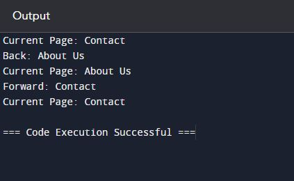

<h1>Here I will be adding my DSF assignment projects using python</h1>
1. <a href="Browser Simulator.py">Browser Simulator:</a> Navigating History with Back and Forward Buttons
 
 
Web browsers provide the functionality to navigate back and forth between pages that a user has visited. This feature enhances user experience by allowing easy access to previously seen content without needing to retype URLs or use the search function. The ability to mimic this behavior requires tracking the sequence of visited pages and managing actions such as going back to a previous page or moving forward to a page that was visited before clicking back. Implementing this feature effectively necessitates the use of a data structure that can efficiently handle insertion and deletion operations, as well as sequential access to elements in a last-in, first-out (LIFO) manner. This problem statement focuses on creating a Python program that simulates the behavior of back and forward buttons in a browser using stack data structures.

<h3>Operations/Methods:</h3>

visit_page( page ): Adds a visited page to the stack.

back(): Moves to the previous page in the stack.

forward(): Moves to the next page in the stack.

current_page(): Returns the current page without changing the navigation state.

 <h4>Algorithms for Identified Methods:</h4>

visit_page( page ): 
 Push the current page onto the stack.
 Set the current page to the new page.

back():
 Pop the top page from the stack.
 Set the current page to the popped page.

forward():
If there are pages in the forward stack:
Pop the top page from the forward stack.
Push the current page onto the back stack.
Set the current page to the popped page.

current_page():
 Return the current page without modifying the stack.

